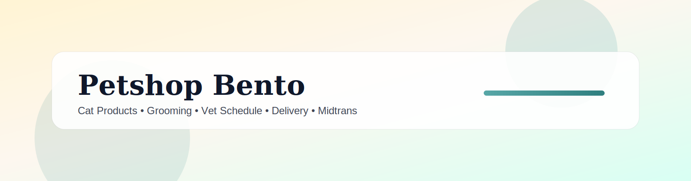

# Petshop Bento



[](https://go.dev/)
[](https://adoptium.net/)
[](https://spring.io/projects/spring-boot)
[](https://react.dev/)
[](https://www.postgresql.org/)
[](https://vitejs.dev/)

Full-stack petshop platform for cat products, services, and vet scheduling in Indonesia. Includes member tiers, vouchers, cashback, and Midtrans payments.

## Features

| Category | Features |
| --- | --- |
| Storefront | Product catalog, cart, checkout, delivery info |
| Services | Grooming, boarding, free consultation, vet appointments |
| Membership | Register/login, tiers (Bronze/Silver/Gold/Platinum), automatic tier upgrades |
| Rewards | Tier-based discounts, cashback wallet, vouchers, welcome voucher |
| Payments | Midtrans Snap payment, status checking, webhook updates |
| Delivery | Flat zone fee, per-km fee (distance), external shipping provider |
| Media | Product image upload and display |
| Admin | Products, schedules, appointments, bookings, members, vouchers, staff management |
| Analytics | Member spend ranking, order list with status controls |

## Tech Stack

- Frontend: React + Vite
- Core API: Go (catalog, cart, order, membership, vouchers)
- Booking API: Java Spring Boot (schedules, services, Midtrans)
- Database: PostgreSQL

## Monorepo Structure

- `apps/web` - Customer website
- `apps/admin` - Admin dashboard
- `services/core-go` - Core API (Go)
- `services/booking-java` - Booking & payment API (Java)
- `infra/db` - SQL schemas
- `docs` - API and architecture notes

## Local Setup

1) Create environment files:
```
copy .env.example .env
copy apps\web\.env.example apps\web\.env
copy apps\admin\.env.example apps\admin\.env
```

2) Start databases:
```
docker compose up -d db-core db-booking
```

3) Start services:
```
# Go core
cd services\core-go
 go run .

# Java booking
cd services\booking-java
 gradle bootRun
```

4) Start frontends:
```
cd apps\web
 npm install
 npm run dev

cd apps\admin
 npm install
 npm run dev
```

## Admin Bootstrap

Create the first admin user (only once):

```
Invoke-RestMethod -Method Post -Uri http://localhost:8081/admin/bootstrap -ContentType 'application/json' -Body '{
  "name":"Owner",
  "email":"admin@petshop.local",
  "phone":"0800000000",
  "password":"admin123",
  "secret":"CHANGE_ME"
}'
```

Then login at `apps/admin` using `/admin/login`.

## Midtrans Webhook

Point Midtrans webhook to:
```
http://<booking-host>:8082/payments/midtrans/webhook
```
Booking service forwards webhook payloads to core API:
```
http://localhost:8081/webhooks/midtrans
```
Make sure `CORE_WEBHOOK_SECRET` matches on both services.

## Delivery Options

Supported delivery modes:
1) **Flat fee by zone** (admin-managed zones)
2) **Per-km fee** (Haversine distance from store coordinates)
3) **External shipping provider** (via env config)

Use `POST /delivery/quote` to calculate shipping fee before checkout.

### External Provider (Placeholder)
Default provider: **Shipper** (placeholder integration). Set in `.env`:
- `EXTERNAL_SHIPPING_PROVIDER=shipper`
- `SHIPPER_API_KEY`
- `SHIPPER_API_BASE_URL`
- `SHIPPER_PICKUP_*` values

When configured, the code currently returns a mocked fee and message. Replace the placeholder in `services/core-go/delivery.go` with real Shipper API calls when ready.

## Configuration

Key environment variables:
- `CORE_DB_URL`, `CORE_PORT`
- `BOOKING_DB_URL`, `BOOKING_DB_USER`, `BOOKING_DB_PASS`, `BOOKING_PORT`
- `MIDTRANS_SERVER_KEY`, `MIDTRANS_SNAP_URL`, `MIDTRANS_STATUS_URL`
- `ADMIN_BOOTSTRAP_SECRET`, `CORE_WEBHOOK_SECRET`, `BOOKING_ADMIN_SECRET`
- `EXTERNAL_SHIPPING_PROVIDER`, `EXTERNAL_SHIPPING_URL`, `EXTERNAL_SHIPPING_KEY`
- `SESSION_TTL_HOURS`

## API Overview

See `docs/api.md` for full endpoints.

## Contribution

We welcome contributions. Contributors:

<table>
  <tr>
    <td align="center">
      <a href="https://github.com/msellisaa">
        
      </a>
      <br />
      <strong>Michelle Isaura Aishaa</strong>
      <br />
      Owner
    </td>
    <td align="center">
      <a href="https://github.com/aliahmadnawawi">
        
      </a>
      <br />
      <strong>Ali Ahmad Nawawi</strong>
    </td>
    <td align="center">
      <a href="https://github.com/nazilalailatulafifah">
        
      </a>
      <br />
      <strong>Ziziel</strong>
    </td>
  </tr>
</table>

Want to contribute? Please open an issue or submit a PR with clear description and screenshots if UI changes.

## Shop Info

- Address: Jl. Cikande Permai No.11-12 Blok L9 Komp, Situterate, Kec. Cikande, Kabupaten Serang, Banten 42186, Indonesia
- Phone: +62 896-4385-2920
- Maps: -6.2216339332113595, 106.34573045889455

---

**Note:** This project is still under active development.
